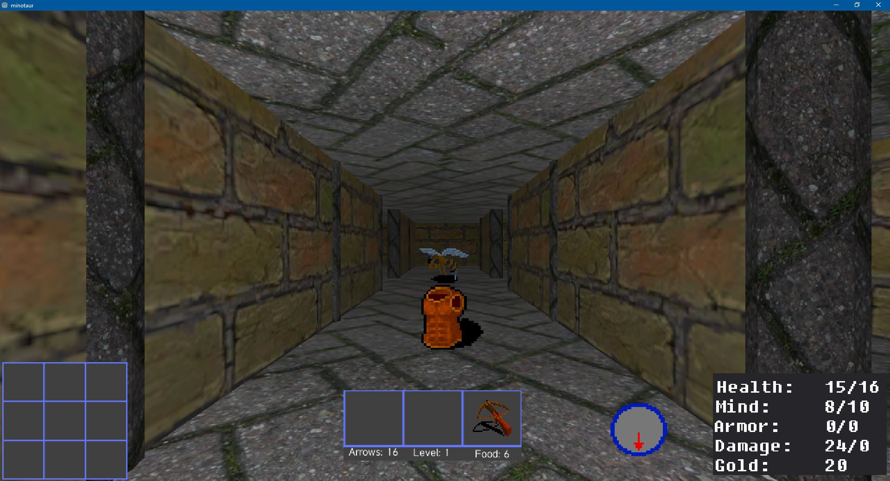

# minotaur
Treasure of Tarmin remake in Godot 3 (Godot 2 versions in godot2_master and godot2_retro)

Loved this game as a kid, so I decided to remake in Godot for learning/fun.
This result is two weeks of after work/weekends effort, so don't expect polished brilliance.

There are two branches:  master and retro.  Master has some free textures on walls/floors and doors while 
the retro version has colors closer to the original.  This is not well play balanced, could be too easy or hard!

Have fun!

